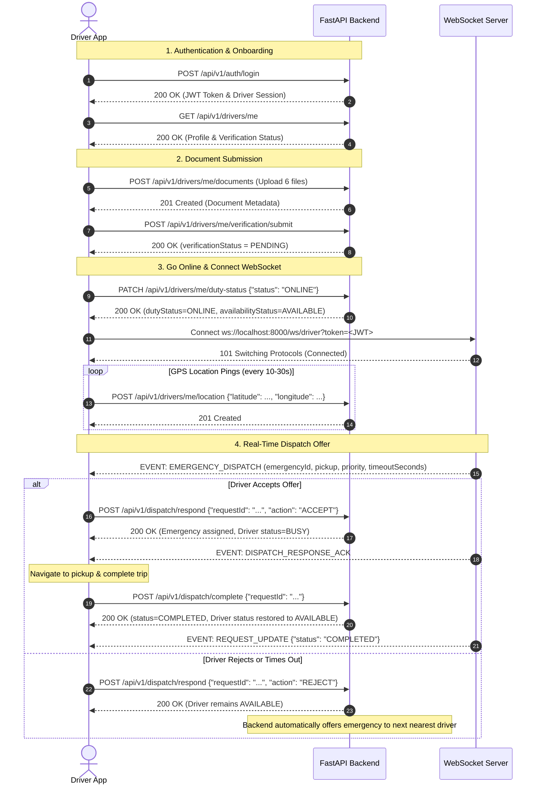

# 🚑 RapidRescue Driver App — Backend API Contract

**Version:** 1.0.0  
**Target Platform:** RapidRescue Driver Mobile App (Android / iOS / Web)  
**Authority:** Generated directly from active RapidRescue FastAPI Backend source code.

---

## 1. BASE URL & CONNECTIONS

### Development Base URLs
- **Localhost (Web / Postman):** `http://localhost:8000` or `http://127.0.0.1:8000`
- **Android Emulator:** `http://10.0.2.2:8000` *(Android emulator routes `10.0.2.2` to the host machine's `127.0.0.1`)*
- **Physical Android / iOS Device:** `http://<YOUR_LOCAL_IP>:8000` (e.g., `http://192.168.1.5:8000`)
- **WebSocket URL:** `ws://localhost:8000/ws/driver` *(or `ws://10.0.2.2:8000/ws/driver` on Android Emulator)*

### API Documentation Links
- **Swagger Interactive UI:** `http://localhost:8000/docs`
- **ReDoc Interactive UI:** `http://localhost:8000/redoc`
- **OpenAPI Schema JSON:** `http://localhost:8000/openapi.json`

---

## 2. AUTHENTICATION

All authenticated endpoints require a standard HTTP `Authorization` header containing the JWT Bearer token obtained during login:

```http
Authorization: Bearer <your_jwt_access_token>
```

---

### 2.1 Register Driver
**Endpoint:** `POST /api/v1/auth/register`  
**Authentication:** None (Public)  
**Content-Type:** `application/json`  
**Source:** [`app/api/auth.py`](file:///c:/Users/Nature/Desktop/backend/app/api/auth.py#L16)

#### Request Body:
```json
{
  "fullName": "John Doe",
  "mobileNumber": "9876543210",
  "email": "johndoe@example.com",
  "password": "Password123",
  "confirmPassword": "Password123",
  "dateOfBirth": "1990-05-15",
  "address": "123 Main Street, Bangalore",
  "emergencyContact": "9876543211",
  "driverIdPlaceholder": "BADGE-999",
  "yearsOfExperience": 5
}
```

#### Field Constraints:
- `fullName`: String (min length 2)
- `mobileNumber`: String (10-digit mobile number, unique)
- `email`: String (valid email, unique)
- `password`: String (min length 6)
- `confirmPassword`: String (must match `password`)
- `dateOfBirth`: String (YYYY-MM-DD, optional)
- `address`: String (optional)
- `emergencyContact`: String (optional)
- `driverIdPlaceholder`: String (optional custom badge ID)
- `yearsOfExperience`: Integer (>= 0, default: 0)

#### Response `201 Created`:
```json
{
  "success": true,
  "message": "Driver registered successfully",
  "driverId": "DRV-8f3a9b1c2d4e",
  "verificationStatus": "NOT_SUBMITTED",
  "dutyStatus": "OFFLINE",
  "availabilityStatus": "UNAVAILABLE"
}
```

#### Status Codes:
- `201 Created` — Driver registered successfully.
- `400 Bad Request` — Mobile number/email already registered, passwords do not match, or validation failed.
- `422 Unprocessable Entity` — Invalid input JSON schema.

---

### 2.2 Driver Login
**Endpoint:** `POST /api/v1/auth/login`  
**Authentication:** None (Public)  
**Content-Type:** `application/json`  
**Source:** [`app/api/auth.py`](file:///c:/Users/Nature/Desktop/backend/app/api/auth.py#L44)

#### Request Body:
```json
{
  "mobileNumber": "9876543210",
  "password": "Password123"
}
```

---

### 2.3 Patient Register
**Endpoint:** `POST /api/v1/auth/patient/register`  
**Authentication:** None (Public)  
**Content-Type:** `application/json`  
**Source:** [`app/api/auth.py`](file:///c:/Users/Nature/Desktop/backend/app/api/auth.py#L75)

#### Request Body:
```json
{
  "fullName": "Jane Doe",
  "mobileNumber": "9876543210",
  "password": "PatientPassword123",
  "email": "janedoe@example.com",
  "address": "456 Park Avenue, Bangalore",
  "bloodGroup": "O+",
  "emergencyContactName": "John Doe",
  "emergencyContactRelationship": "Spouse",
  "emergencyContactMobile": "9876543211"
}
```

#### Response `201 Created`:
```json
{
  "success": true,
  "message": "Patient registered successfully",
  "patientId": "c3b5a9e1-4b10-4f93-8b9a-112233445566",
  "fullName": "Jane Doe",
  "mobileNumber": "9876543210",
  "email": "janedoe@example.com",
  "createdAt": "2026-09-30T18:30:00+00:00"
}
```

#### Status Codes:
- `201 Created` — Patient registered successfully.
- `409 Conflict` — Mobile number or email address is already registered.
- `422 Unprocessable Entity` — Validation error.

---

### 2.4 Patient Login
**Endpoint:** `POST /api/v1/auth/patient/login`  
**Authentication:** None (Public)  
**Content-Type:** `application/json`  
**Source:** [`app/api/auth.py`](file:///c:/Users/Nature/Desktop/backend/app/api/auth.py#L100)

#### Request Body:
```json
{
  "identifier": "9876543210",
  "password": "PatientPassword123"
}
```
*(Supports either mobile number or email address as `identifier`)*

#### Response `200 OK`:
```json
{
  "success": true,
  "message": "Login successful",
  "userId": "c3b5a9e1-4b10-4f93-8b9a-112233445566",
  "patientId": "c3b5a9e1-4b10-4f93-8b9a-112233445566",
  "role": "PATIENT",
  "fullName": "Jane Doe",
  "mobileNumber": "9876543210",
  "email": "janedoe@example.com",
  "token": "<jwt_access_token>",
  "createdAt": "2026-09-30T18:30:00+00:00",
  "session": {
    "userId": "c3b5a9e1-4b10-4f93-8b9a-112233445566",
    "patientId": "c3b5a9e1-4b10-4f93-8b9a-112233445566",
    "role": "PATIENT",
    "fullName": "Jane Doe",
    "mobileNumber": "9876543210",
    "email": "janedoe@example.com",
    "token": "<jwt_access_token>",
    "createdAt": "2026-09-30T18:30:00+00:00"
  }
}
```

#### Status Codes:
- `200 OK` — Login successful, JWT issued.
- `401 Unauthorized` — Invalid credentials or deactivated account.

---

### 2.5 Get Patient Profile
**Endpoint:** `GET /api/v1/patients/me`  
**Authentication:** `Authorization: Bearer <patient_jwt>`  
**Source:** [`app/api/patient.py`](file:///c:/Users/Nature/Desktop/backend/app/api/patient.py#L14)

#### Response `200 OK`:
```json
{
  "id": "c3b5a9e1-4b10-4f93-8b9a-112233445566",
  "fullName": "Jane Doe",
  "mobileNumber": "9876543210",
  "email": "janedoe@example.com",
  "address": "456 Park Avenue, Bangalore",
  "bloodGroup": "O+",
  "emergencyContactName": "John Doe",
  "emergencyContactRelationship": "Spouse",
  "emergencyContactMobile": "9876543211",
  "createdAt": "2026-09-30T18:30:00+00:00"
}
```

#### Status Codes:
- `200 OK` — Profile fetched successfully.
- `401 Unauthorized` — Missing, expired, or invalid JWT.
- `403 Forbidden` — Insufficient role/permissions.

---

### 2.6 Update Patient Profile
**Endpoint:** `PATCH /api/v1/patients/me`  
**Authentication:** `Authorization: Bearer <patient_jwt>`  
**Source:** [`app/api/patient.py`](file:///c:/Users/Nature/Desktop/backend/app/api/patient.py#L32)

#### Request Body:
```json
{
  "address": "789 MG Road, Bangalore",
  "bloodGroup": "A+"
}
```

#### Response `200 OK`:
Returns updated patient profile object.


#### Response `200 OK`:
```json
{
  "success": true,
  "session": {
    "userId": "DRV-8f3a9b1c2d4e",
    "role": "DRIVER",
    "driverId": "DRV-8f3a9b1c2d4e",
    "name": "John Doe",
    "displayName": "John Doe",
    "mobileNumber": "9876543210",
    "email": "johndoe@example.com",
    "yearsOfExperience": 5,
    "token": "eyJhbGciOiJIUzI1NiIsInR5cCI6IkpXVCJ9...",
    "createdAt": "2026-09-28T09:40:00.000000+00:00",
    "isMockSession": false
  },
  "message": "Login successful"
}
```

#### Status Codes:
- `200 OK` — Credentials valid, returns JWT token and driver session data.
- `401 Unauthorized` — Invalid mobile number or password.
- `422 Unprocessable Entity` — Missing required credentials.

---

## 3. DRIVER PROFILE

### 3.1 Get Driver Profile
**Endpoint:** `GET /api/v1/drivers/me`  
**Authentication:** Required (`Bearer Token`)  
**Source:** [`app/api/driver.py`](file:///c:/Users/Nature/Desktop/backend/app/api/driver.py#L19)

#### Response `200 OK`:
```json
{
  "id": "DRV-8f3a9b1c2d4e",
  "fullName": "John Doe",
  "mobileNumber": "9876543210",
  "email": "johndoe@example.com",
  "dateOfBirth": "1990-05-15",
  "address": "123 Main Street, Bangalore",
  "emergencyContact": "9876543211",
  "yearsOfExperience": 5,
  "isVerified": true,
  "verificationStatus": "VERIFIED",
  "dutyStatus": "ONLINE",
  "availability": "AVAILABLE"
}
```

#### Enumerated Status Values:
- `verificationStatus`: `"NOT_SUBMITTED"`, `"PENDING"`, `"UNDER_REVIEW"`, `"VERIFIED"`, `"REJECTED"`
- `dutyStatus`: `"OFFLINE"`, `"ONLINE"`
- `availability`: `"UNAVAILABLE"`, `"AVAILABLE"`, `"BUSY"`

#### Status Codes:
- `200 OK` — Profile fetched successfully.
- `401 Unauthorized` — Missing or invalid JWT token.

---

## 4. DRIVER DOCUMENTS & VERIFICATION

### 4.1 Upload Verification Document
**Endpoint:** `POST /api/v1/drivers/me/documents`  
**Authentication:** Required (`Bearer Token`)  
**Content-Type:** `multipart/form-data`  
**Source:** [`app/api/verification.py`](file:///c:/Users/Nature/Desktop/backend/app/api/verification.py#L16) & [`app/services/verification_service.py`](file:///c:/Users/Nature/Desktop/backend/app/services/verification_service.py#L45)

#### Multipart Form Fields:
- `document_type` (Form string): Allowed values:
  - `DRIVING_LICENSE` (Category: DRIVER)
  - `GOVERNMENT_ID` (Category: DRIVER)
  - `DRIVER_SELFIE` (Category: DRIVER)
  - `AMBULANCE_REGISTRATION` (Category: AMBULANCE)
  - `AMBULANCE_PERMIT` (Category: AMBULANCE)
  - `VEHICLE_INSURANCE` (Category: AMBULANCE)
- `file` (File binary):
  - Allowed MIME types for documents: `image/jpeg`, `image/png`, `image/webp`, `application/pdf`.
  - **Constraint:** `DRIVER_SELFIE` MUST be an image (`image/jpeg`, `image/png`, `image/webp`).
  - **Max File Size:** 10 MB (10,485,760 bytes).

#### Response `201 Created`:
```json
{
  "id": "DOC-7a8b9c0d1e2f",
  "driverId": "DRV-8f3a9b1c2d4e",
  "documentType": "DRIVING_LICENSE",
  "category": "DRIVER",
  "fileUrl": "/uploads/driver_documents/DRV-8f3a9b1c2d4e_DRIVING_LICENSE_1a2b3c4d.jpg",
  "fileName": "license.jpg",
  "mimeType": "image/jpeg",
  "fileSizeBytes": 1048576,
  "status": "UPLOADED",
  "rejectionReason": null,
  "uploadedAt": "2026-09-28T09:40:00.000000+00:00"
}
```

#### Status Codes:
- `201 Created` — Document uploaded successfully.
- `400 Bad Request` — Invalid document type, file size > 10MB, empty file, or invalid MIME type.
- `401 Unauthorized` — Token missing/invalid.

---

### 4.2 Submit Documents for Verification
**Endpoint:** `POST /api/v1/drivers/me/verification/submit`  
**Authentication:** Required (`Bearer Token`)  
**Source:** [`app/api/verification.py`](file:///c:/Users/Nature/Desktop/backend/app/api/verification.py#L45)

*Requires all 6 mandatory document types (`DRIVING_LICENSE`, `GOVERNMENT_ID`, `DRIVER_SELFIE`, `AMBULANCE_REGISTRATION`, `AMBULANCE_PERMIT`, `VEHICLE_INSURANCE`) to be uploaded.*

#### Response `200 OK`:
```json
{
  "success": true,
  "message": "Verification submitted successfully",
  "verificationStatus": "PENDING"
}
```

#### Status Codes:
- `200 OK` — Verification submitted, status changed to `PENDING`.
- `400 Bad Request` — Missing required document types.
- `401 Unauthorized` — Token missing/invalid.

---

### 4.3 Get Driver Verification Status & Documents
**Endpoint:** `GET /api/v1/drivers/me/verification`  
**Authentication:** Required (`Bearer Token`)  
**Source:** [`app/api/verification.py`](file:///c:/Users/Nature/Desktop/backend/app/api/verification.py#L58)

#### Response `200 OK`:
```json
{
  "verificationStatus": "PENDING",
  "documents": [
    {
      "id": "DOC-7a8b9c0d1e2f",
      "driverId": "DRV-8f3a9b1c2d4e",
      "documentType": "DRIVING_LICENSE",
      "category": "DRIVER",
      "fileUrl": "/uploads/driver_documents/DRV-8f3a9b1c2d4e_DRIVING_LICENSE_1a2b3c4d.jpg",
      "fileName": "license.jpg",
      "mimeType": "image/jpeg",
      "fileSizeBytes": 1048576,
      "status": "UPLOADED",
      "rejectionReason": null,
      "uploadedAt": "2026-09-28T09:40:00.000000+00:00"
    }
  ]
}
```

---

### 4.4 Admin Review Endpoints (Backoffice / Testing)
**Source:** [`app/api/admin.py`](file:///c:/Users/Nature/Desktop/backend/app/api/admin.py)

1. `POST /api/v1/admin/drivers/{driver_id}/verification/start-review`
   - Changes status to `UNDER_REVIEW`.
2. `POST /api/v1/admin/drivers/{driver_id}/verification/approve`
   - Changes status to `VERIFIED`.
3. `POST /api/v1/admin/drivers/{driver_id}/verification/reject`
   - Request Body: `{ "rejectedDocumentType": "DRIVING_LICENSE", "rejectionReason": "Blurry image" }`
   - Changes driver status to `REJECTED` and marks the specific document as `REJECTED`.

---

## 5. DUTY STATUS MANAGEMENT

### 5.1 Toggle Duty Status
**Endpoint:** `PATCH /api/v1/drivers/me/duty-status`  
**Authentication:** Required (`Bearer Token`)  
**Content-Type:** `application/json`  
**Source:** [`app/api/driver.py`](file:///c:/Users/Nature/Desktop/backend/app/api/driver.py#L40)

#### Request Body:
```json
{
  "status": "ONLINE"
}
```
*Allowed values:* `"ONLINE"`, `"OFFLINE"`

#### Automatic Side-Effects:
- Setting `ONLINE` automatically transitions `availability_status` to `"AVAILABLE"`.
- Setting `OFFLINE` automatically transitions `availability_status` to `"UNAVAILABLE"`.

#### Response `200 OK`:
```json
{
  "success": true,
  "dutyStatus": "ONLINE",
  "availabilityStatus": "AVAILABLE",
  "message": "Duty status updated to ONLINE"
}
```

#### Status Codes:
- `200 OK` — Duty status updated.
- `400 Bad Request` — Driver not yet verified (unverified drivers cannot go ONLINE).
- `401 Unauthorized` — Token missing/invalid.

---

## 6. AVAILABILITY MANAGEMENT

### 6.1 Toggle Availability Status
**Endpoint:** `PATCH /api/v1/drivers/me/availability`  
**Authentication:** Required (`Bearer Token`)  
**Content-Type:** `application/json`  
**Source:** [`app/api/driver.py`](file:///c:/Users/Nature/Desktop/backend/app/api/driver.py#L60)

#### Request Body:
```json
{
  "status": "AVAILABLE"
}
```
*Allowed values:* `"AVAILABLE"`, `"UNAVAILABLE"`, `"BUSY"`

#### Response `200 OK`:
```json
{
  "success": true,
  "availabilityStatus": "AVAILABLE",
  "message": "Availability status updated to AVAILABLE"
}
```

#### Status Codes:
- `200 OK` — Availability status updated.
- `400 Bad Request` — Driver is OFFLINE or unverified.
- `401 Unauthorized` — Token missing/invalid.

---

## 7. GPS / LOCATION UPDATES

### 7.1 Send Driver Location Ping
**Endpoint:** `POST /api/v1/drivers/me/location`  
**Authentication:** Required (`Bearer Token`)  
**Content-Type:** `application/json`  
**Source:** [`app/api/location.py`](file:///c:/Users/Nature/Desktop/backend/app/api/location.py#L14)

#### Request Body:
```json
{
  "latitude": 12.9716,
  "longitude": 77.5946,
  "accuracy": 5.0,
  "altitude": 920.5,
  "heading": 180.0,
  "speed": 12.5,
  "timestamp": "2026-09-28T09:40:00.000Z"
}
```

#### Field Constraints:
- `latitude`: Float (-90.0 to 90.0, required)
- `longitude`: Float (-180.0 to 180.0, required)
- `accuracy`: Float in meters (>= 0.0, optional)
- `altitude`: Float in meters (optional)
- `heading`: Float in degrees (0.0 to 360.0, optional)
- `speed`: Float in m/s (>= 0.0, optional)
- `timestamp`: Epoch ms/seconds or ISO string (optional)

#### Response `201 Created`:
```json
{
  "success": true,
  "message": "Location updated successfully",
  "recordedAt": "2026-09-28T09:40:00+00:00"
}
```

#### Status Codes:
- `201 Created` — Location ping saved.
- `401 Unauthorized` — Token missing/invalid.
- `422 Unprocessable Entity` — Latitude/Longitude out of range.

---

## 8. AMBULANCE MODULE

### 8.1 Register / Update Ambulance
**Endpoint:** `POST /api/v1/ambulances`  
**Authentication:** Required (`Bearer Token`)  
**Content-Type:** `application/json`  
**Source:** [`app/api/ambulance.py`](file:///c:/Users/Nature/Desktop/backend/app/api/ambulance.py#L13)

#### Request Body:
```json
{
  "registrationNumber": "KA-01-EQ-9999",
  "ambulanceType": "BLS",
  "equipmentCapabilities": ["OXYGEN", "DEFIBRILLATOR", "STRETCHER"],
  "hospitalAffiliation": "City Central Hospital"
}
```

#### Field Constraints:
- `registrationNumber`: String (min length 2, unique)
- `ambulanceType`: Allowed values: `"BLS"`, `"ALS"`, `"PATIENT_TRANSPORT"`
- `equipmentCapabilities`: Array of strings (optional)
- `hospitalAffiliation`: String (optional)

#### Response `201 Created`:
```json
{
  "id": "AMB-4a2b6c8d1e2f",
  "driverId": "DRV-8f3a9b1c2d4e",
  "registrationNumber": "KA-01-EQ-9999",
  "ambulanceType": "BLS",
  "equipmentCapabilities": ["OXYGEN", "DEFIBRILLATOR", "STRETCHER"],
  "hospitalAffiliation": "City Central Hospital"
}
```

---

### 8.2 Get My Ambulance
**Endpoint:** `GET /api/v1/ambulances/me`  
**Authentication:** Required (`Bearer Token`)  
**Source:** [`app/api/ambulance.py`](file:///c:/Users/Nature/Desktop/backend/app/api/ambulance.py#L38)

#### Response `200 OK`:
```json
{
  "id": "AMB-4a2b6c8d1e2f",
  "driverId": "DRV-8f3a9b1c2d4e",
  "registrationNumber": "KA-01-EQ-9999",
  "ambulanceType": "BLS",
  "equipmentCapabilities": ["OXYGEN", "DEFIBRILLATOR", "STRETCHER"],
  "hospitalAffiliation": "City Central Hospital"
}
```

#### Status Codes:
- `200 OK` — Ambulance profile returned.
- `404 Not Found` — No ambulance associated with current driver.

---

## 9. EMERGENCY & DISPATCH

### 9.1 Respond to Emergency Dispatch Offer
**Endpoint:** `POST /api/v1/dispatch/respond`  
**Authentication:** Required (`Bearer Token`)  
**Content-Type:** `application/json`  
**Source:** [`app/api/dispatch.py`](file:///c:/Users/Nature/Desktop/backend/app/api/dispatch.py#L18) & [`app/services/dispatch_service.py`](file:///c:/Users/Nature/Desktop/backend/app/services/dispatch_service.py#L225)

#### Request Body:
```json
{
  "requestId": "edeafc80-e5f7-4678-af2e-4651484ae48f",
  "action": "ACCEPT"
}
```
*Allowed actions:* `"ACCEPT"`, `"REJECT"`, `"TIMEOUT"`

#### Behavior per Action:
- **`ACCEPT`**:
  - Validates concurrency via PostgreSQL `FOR UPDATE` lock.
  - Updates emergency status to `"ACCEPTED"` and sets `assigned_driver_id`.
  - Updates driver `availability_status` to `"BUSY"`.
  - Returns `200 OK` and sends WebSocket `DISPATCH_RESPONSE_ACK`.
- **`REJECT` / `TIMEOUT`**:
  - Records response entry in `emergency_responses`.
  - Keeps driver `availability_status` as `"AVAILABLE"`.
  - Automatically transfers offer to the next nearest eligible candidate driver.

#### Response `200 OK`:
```json
{
  "success": true,
  "requestId": "edeafc80-e5f7-4678-af2e-4651484ae48f",
  "action": "ACCEPT"
}
```

#### Status Codes:
- `200 OK` — Response recorded.
- `400 Bad Request` — Invalid action or UUID format.
- `404 Not Found` — Emergency request ID does not exist.
- `409 Conflict` — Emergency already assigned to another responder or dispatch offer expired.

---

### 9.2 Complete Emergency Trip
**Endpoint:** `POST /api/v1/dispatch/complete`  
**Authentication:** Required (`Bearer Token`)  
**Content-Type:** `application/json`  
**Source:** [`app/api/dispatch.py`](file:///c:/Users/Nature/Desktop/backend/app/api/dispatch.py#L38) & [`app/services/dispatch_service.py`](file:///c:/Users/Nature/Desktop/backend/app/services/dispatch_service.py#L309)

#### Request Body:
```json
{
  "requestId": "edeafc80-e5f7-4678-af2e-4651484ae48f"
}
```

#### Behavior:
- Updates emergency status to `"COMPLETED"` and sets `completed_at` timestamp.
- Restores driver `availability_status` to `"AVAILABLE"`.
- Sends WebSocket `REQUEST_UPDATE` notification.

#### Response `200 OK`:
```json
{
  "success": true,
  "requestId": "edeafc80-e5f7-4678-af2e-4651484ae48f",
  "status": "COMPLETED"
}
```

---

---

### 9.4 Patient Photo Authorization Endpoint
**Endpoint:** `GET /api/v1/emergencies/{emergency_id}/photos/{photo_type}`  
**Authentication:** Required (`Bearer Token` or `?token=<JWT>`)  
**Source:** [`app/api/emergency.py`](file:///c:/Users/Nature/Desktop/backend/app/api/emergency.py#L125)

#### Path Parameters:
- `emergency_id`: Emergency UUID
- `photo_type`: Allowed values: `"front"`, `"rear"`

#### Authorization Rules:
- Patient who created the emergency CAN view photos.
- Assigned driver or offered candidate driver CAN view photos.
- Unrelated drivers or users CANNOT view photos (`403 Forbidden`).

#### Response `200 OK`:
Returns raw image bytes (`Content-Type: image/jpeg` or `image/png`).

---

## 10. REAL-TIME WEBSOCKET INTERACTION & LIVE TRACKING

### 10.1 Connections & Authentication Handshake

#### Driver WebSocket:
- **URL:** `ws://localhost:8000/ws/driver?token=<jwt_access_token>`
- **Source:** [`app/api/websocket.py`](file:///c:/Users/Nature/Desktop/backend/app/api/websocket.py#L12)

#### Patient WebSocket:
- **URL:** `ws://localhost:8000/ws/patient?token=<jwt_access_token>&emergency_id=<uuid>`
- **Source:** [`app/api/websocket.py`](file:///c:/Users/Nature/Desktop/backend/app/api/websocket.py#L52)

---

### 10.2 Implemented WebSocket Events

#### Event 1: `EMERGENCY_DISPATCH` (Server → Driver App)
Pushed automatically to the assigned/offered candidate driver when an emergency is dispatched. Contains full patient details and location.

```json
{
  "type": "EMERGENCY_DISPATCH",
  "data": {
    "emergencyId": "edeafc80-e5f7-4678-af2e-4651484ae48f",
    "emergencyType": "CARDIAC_ARREST",
    "priority": "CRITICAL",
    "patient": {
      "name": "Jane Doe",
      "phone": "9876543210",
      "photoUrl": "http://localhost:8000/api/v1/emergencies/edeafc80-e5f7-4678-af2e-4651484ae48f/photos/front"
    },
    "pickupLocation": {
      "latitude": 12.9716,
      "longitude": 77.5946
    },
    "distanceKm": 1.25,
    "etaMinutes": 3.4,
    "createdAt": "2026-09-28T09:40:00.000Z",
    "responseDeadline": "2026-09-28T09:40:20.000Z",
    "timeoutSeconds": 20
  }
}
```

---

#### Event 2: `DRIVER_ASSIGNED` (Server → Patient App)
Pushed to patient when a driver accepts the emergency offer.

```json
{
  "event": "DRIVER_ASSIGNED",
  "data": {
    "emergencyId": "edeafc80-e5f7-4678-af2e-4651484ae48f",
    "driver": {
      "driverId": "DRV-8f3a9b1c2d4e",
      "name": "John Doe"
    },
    "ambulance": {
      "ambulanceId": "AMB-4a2b6c8d1e2f",
      "registrationNumber": "KA-01-EQ-9999",
      "ambulanceType": "BLS"
    },
    "assignedAt": "2026-09-28T09:40:05.000Z"
  }
}
```

---

#### Event 3: `PATIENT_LOCATION` (Server → Driver App)
Pushed to the driver after accepting the emergency so they can plot the patient marker.

```json
{
  "event": "PATIENT_LOCATION",
  "data": {
    "emergencyId": "edeafc80-e5f7-4678-af2e-4651484ae48f",
    "latitude": 12.9716,
    "longitude": 77.5946,
    "accuracy": 5.0
  }
}
```

---

#### Event 4: `DRIVER_LOCATION_UPDATE` (Server → Patient App)
Pushed to patient whenever assigned driver posts location update (`POST /api/v1/drivers/me/location`).

```json
{
  "event": "DRIVER_LOCATION_UPDATE",
  "data": {
    "emergencyId": "edeafc80-e5f7-4678-af2e-4651484ae48f",
    "driverId": "DRV-8f3a9b1c2d4e",
    "ambulanceId": "AMB-4a2b6c8d1e2f",
    "latitude": 12.9718,
    "longitude": 77.5948,
    "accuracy": 5.0,
    "speedMps": 10.0,
    "headingDegrees": 90.0,
    "recordedAt": "2026-09-28T09:40:15.000Z"
  }
}
```

---

#### Event 5: `ETA_UPDATE` (Server → Driver & Patient Apps)
Pushed to both driver and patient when driver location changes during active emergency tracking.

```json
{
  "event": "ETA_UPDATE",
  "data": {
    "emergencyId": "edeafc80-e5f7-4678-af2e-4651484ae48f",
    "distanceKm": 0.85,
    "etaMinutes": 2.1,
    "updatedAt": "2026-09-28T09:40:15.000Z"
  }
}
```

---

#### Event 6: `EMERGENCY_COMPLETED` / `EMERGENCY_CANCELLED` (Server → Driver & Patient Apps)
Pushed when mission ends or is cancelled by patient. Real-time location tracking terminates upon receiving this event.

```json
{
  "event": "EMERGENCY_COMPLETED",
  "data": {
    "emergencyId": "edeafc80-e5f7-4678-af2e-4651484ae48f",
    "status": "COMPLETED",
    "completedAt": "2026-09-28T09:50:00.000Z"
  }
}
```

---

#### Event 7: `DISPATCH_TIMEOUT` (Server → Driver App)
Pushed to candidate driver if response deadline expires before accept/reject.

```json
{
  "type": "DISPATCH_TIMEOUT",
  "data": {
    "requestId": "edeafc80-e5f7-4678-af2e-4651484ae48f",
    "status": "TIMEOUT"
  }
}
```

---

#### Event 8: `DISPATCH_RESPONSE_ACK` (Server → Driver App)
Pushed to driver upon successful execution of `POST /api/v1/dispatch/respond`.

```json
{
  "type": "DISPATCH_RESPONSE_ACK",
  "data": {
    "requestId": "edeafc80-e5f7-4678-af2e-4651484ae48f",
    "action": "ACCEPT",
    "status": "ACCEPTED"
  }
}
```

---

#### Event 9: `REQUEST_UPDATE` (Server → Driver App)
Pushed to driver when emergency state transitions.

```json
{
  "type": "REQUEST_UPDATE",
  "data": {
    "requestId": "edeafc80-e5f7-4678-af2e-4651484ae48f",
    "status": "COMPLETED"
  }
}
```

---

## 11. IDENTIFIERS & ENTITY MODEL

| ID Name | Format Example | Source & Generation Rule |
|---|---|---|
| `driverId` | `DRV-8f3a9b1c2d4e` | Generated by backend during `POST /api/v1/auth/register`. Format: `DRV-` + 12 hex chars. |
| `emergencyId` / `requestId` | `edeafc80-e5f7-4678-af2e-4651484ae48f` | Standard UUID v4 generated during `POST /api/v1/emergencies`. |
| `ambulanceId` | `AMB-4a2b6c8d1e2f` | Generated by backend during `POST /api/v1/ambulances`. Format: `AMB-` + 12 hex chars. |
| `documentId` | `DOC-7a8b9c0d1e2f` | Generated by backend during document upload `POST /api/v1/drivers/me/documents`. Format: `DOC-` + 12 hex chars. |
| `responseId` | `RESP-9f8e7d6c5b4a` | Generated by backend during dispatch response. Format: `RESP-` + 12 hex chars. |

---

## 12. STANDARD ERROR FORMATS

FastAPI renders HTTP errors using standard JSON structure:

### Standard Error (400, 401, 403, 404, 409, 500)
```json
{
  "detail": "Incident already assigned to another responder"
}
```

### Schema Validation Error (422 Unprocessable Entity)
```json
{
  "detail": [
    {
      "loc": [
        "body",
        "mobileNumber"
      ],
      "msg": "field required",
      "type": "value_error.missing"
    }
  ]
}
```

---

## 13. HTTP STATUS CODES SUMMARY

| Endpoint Path | HTTP Method | Expected Status Codes |
|---|---|---|
| `/api/v1/auth/register` | `POST` | `201`, `400`, `422` |
| `/api/v1/auth/login` | `POST` | `200`, `401`, `422` |
| `/api/v1/drivers/me` | `GET` | `200`, `401` |
| `/api/v1/drivers/me/duty-status` | `PATCH` | `200`, `400`, `401`, `422` |
| `/api/v1/drivers/me/availability` | `PATCH` | `200`, `400`, `401`, `422` |
| `/api/v1/drivers/me/location` | `POST` | `201`, `401`, `422` |
| `/api/v1/drivers/me/documents` | `POST` | `201`, `400`, `401`, `422` |
| `/api/v1/drivers/me/verification/submit` | `POST` | `200`, `400`, `401` |
| `/api/v1/drivers/me/verification` | `GET` | `200`, `401` |
| `/api/v1/ambulances` | `POST` | `201`, `401`, `422` |
| `/api/v1/ambulances/me` | `GET` | `200`, `401`, `404` |
| `/api/v1/emergencies` | `POST` | `201`, `400`, `422` |
| `/api/v1/emergencies/{id}` | `GET` | `200`, `400`, `404` |
| `/api/v1/emergencies/{id}/cancel` | `POST` | `200`, `400`, `404` |
| `/api/v1/dispatch/respond` | `POST` | `200`, `400`, `401`, `404`, `409`, `422` |
| `/api/v1/dispatch/complete` | `POST` | `200`, `400`, `401`, `404`, `422` |
| `/ws/driver` | `WebSocket` | Handshake `101`, Disconnect `1008` |

---

## 14. DRIVER APP INTEGRATION FLOW


